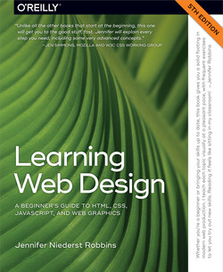
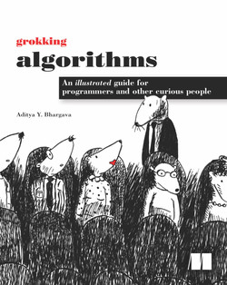

# Hello, my name is Kate Goncharick
  


## Contacts
  **E-mail:** kate.goncharick.artist@gmail.com

  **Discord-name:** Kate Goncharick

 **My github:** [here](https://github.com/KateGoncharik)

************                        
### Who am I?

  I'm 20 year-old-girl from Minsk, Belarus. Whole my life I've been studying art: dancing, painting, singing, plaing piano.. I am fond of literature! 

  But now is the time for me to try something completely different.. 
  So here I am a student of RS School. I have a year to become a junior frontend developer.

*  Speaking of my personal qualities.. the are following:
    * *Good memory*
    * Creative 
    * Quick mind
    * I like to solve  problems
    * Eager to become a good programmer    
    
 ## My education  
1. I've been studying on Dmitry Valok's online-corse [here](https://brainscloud.ru/landing/html-css)

2. JavaScript Manual on learnjavascript.ru (in progress)
  
3. Joined in the middle of RS School stage [#0](https://rs.school/js-stage0/). Made half of the tasks.

## Books I've read
 1. Learning Web Design, 5th Edition (_by Jennifer Robbins_)
  A wide range of topics carefully explained in this book.(read 2/3 of it).

    [](https://www.oreilly.com/library/view/learning-web-design/9781491960196/)

 2. Grokking Algorithms (_by Aditya Bhargava, Jed Limke_)
 Helpfull book from one artist to another. (read half of it) 
 
      [](https://www.oreilly.com/library/view/grokking-algorithms/9781617292231/)

 ## Languages I use

  I freely speak 3 languages: Russian (native), Belarussian (native), English (B2).

##  What I know for now:

     language  | level 
    -----------|---------
    HTML/CSS   |   Basic
        JS     |  5 months 
        
************
## Here is my code:
This code is a solution for tha [KATA](https://www.codewars.com/kata/54e8c3e89e2ae6f4900005a1/javascript) on Codewars: 

_Your task is to add a new property usersAnswer to every object in the array questions. The value of usersAnswer should be set to null. The solution should work for array of any length._
```
        function addProp(arr) {
          for (let i = 0; i < arr.length; i++){
            arr[i].usersAnswer = null;
          }
          return arr;
        }
```
## Project I started with:

My first web-site - [**Cat-page**](https://kategoncharik.github.io/cat-page/).

